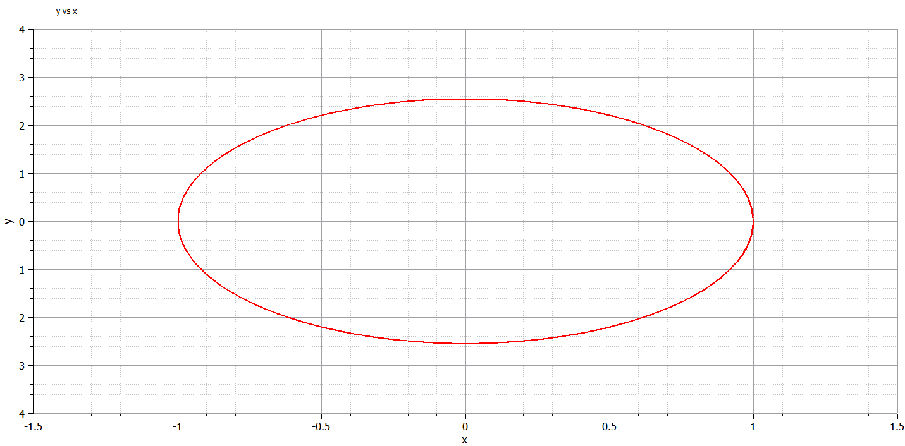
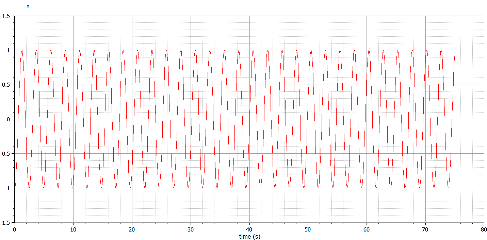
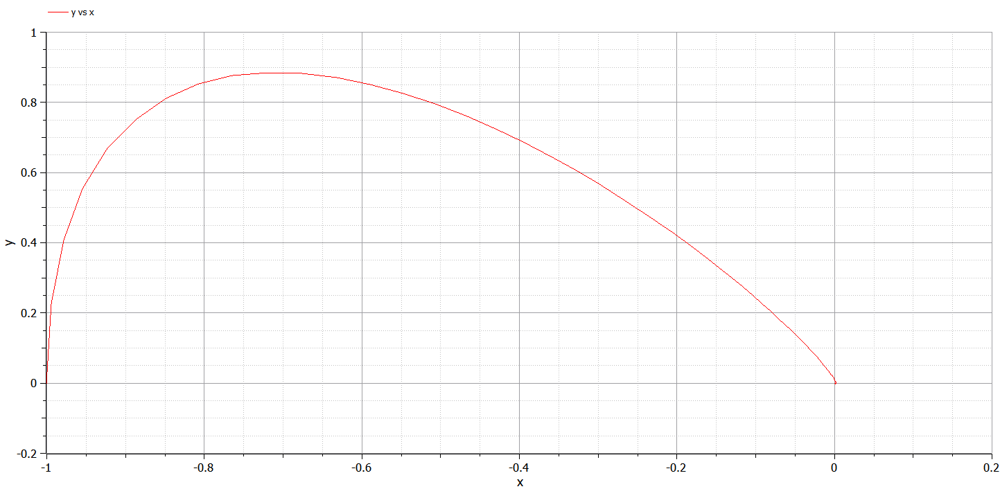
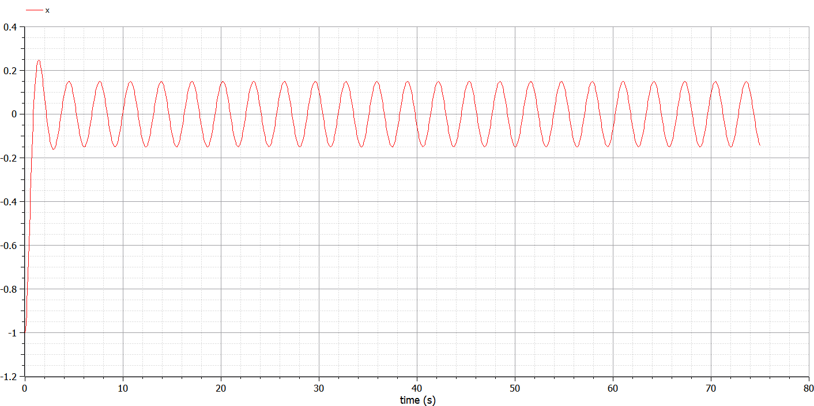

---
## Front matter
lang: ru-RU
title: Лабораторная работа №4
author: |
	Жижченко (Ветошкина) Валерия Викторовна
institute: |
	RUDN University, Moscow, Russian Federation
date: 2021 Москва

## Formatting
mainfont: PT Serif
romanfont: PT Serif
sansfont: PT Serif
monofont: PT Serif
toc: false
slide_level: 2
theme: metropolis
header-includes: 
 - \metroset{progressbar=frametitle,sectionpage=progressbar,numbering=fraction}
 - '\makeatletter'
 - '\beamer@ignorenonframefalse'
 - '\makeatother'
aspectratio: 43
section-titles: true
---

# Цель работы

Рассмотреть модель гармонических колебаний, как пример одной из задач построения математических моделей.

# Задание

Построить фазовый портрет гармонического осциллятора и решение уравнения гармонического осциллятора для следующих случаев:

1. Колебания гармонического осциллятора без затуханий и без действий внешней силы $\ddot{x}+6.5x=0$;
2. Колебания гармонического осциллятора c затуханием и без действий внешней силы $\ddot{x}+4\dot{x}+5x=0$;
3. Колебания гармонического осциллятора c затуханием и под действием внешней силы $\ddot{x}+3\dot{x}+7x=\sin(2t)$;

На интервале $t\in[0; 75]$ (шаг $0.05$) с начальными условиями $x_0=-1, y_0=0$.

# Выполнение лабораторной работы

Движение грузика на пружинке, маятника, заряда в электрическом контуре, а также эволюция во времени многих систем в физике, химии, биологии и других науках при определенных предположениях можно описать одним и тем же дифференциальным уравнением, которое в теории колебаний выступает в качестве основной модели. Эта модель называется линейным гармоническим осциллятором.

## Выполнение лабораторной работы

Уравнение свободных колебаний гармонического осциллятора имеет следующий вид:
$$
\centering
\ddot{x}+2\gamma\dot{x}+\omega_0^2x=0(1)
$$
где $x$ – переменная, описывающая состояние системы (смещение грузика, заряд конденсатора и т.д.),
$\gamma$ – параметр, характеризующий потери энергии (трение в механической системе, сопротивление в контуре),
$\omega_0$ – собственная частота колебаний, $t$ – время. $\left(\mbox{Обозначения }\ddot{x}=\frac{\partial^2x}{\partial^2t}, \dot{x}=\frac{\partial x}{\partial t}\right)$

## Выполнение лабораторной работы

Уравнение $(1)$ есть линейное однородное дифференциальное уравнение второго порядка и оно является примером линейной динамической системы.

## Выполнение лабораторной работы

При отсутствии потерь в системе $\left(\gamma=0\right)$ получаем
уравнение консервативного осциллятора энергия колебания которого сохраняется во времени.
$$
\centering
\ddot{x}+\omega_0^2x=0(2)
$$

## Выполнение лабораторной работы

Для однозначной разрешимости уравнения второго порядка $(2)$ необходимо
задать два начальных условия вида
$$
\centering
\begin{cases}
x(t_0)=x_0\\
\dot{x}(t_0)=y_0
\end{cases}
(3)
$$

## Выполнение лабораторной работы

Уравнение второго порядка $(2)$ можно представить в виде системы двух
уравнений первого порядка:
$$
\centering
\begin{cases}
\dot{x}=y\\
\dot{y}=-\omega_0^2x
\end{cases}
(4)
$$

## Выполнение лабораторной работы

Начальные условия $(3)$ для системы $(4)$ примут вид:
$$
\centering
\begin{cases}
x(t_0)=x_0\\
y(t_0)=y_0
\end{cases}
(5)
$$

## Выполнение лабораторной работы

Независимые переменные $x, y$ определяют пространство, в котором
«движется» решение. Это фазовое пространство системы, поскольку оно двумерно
будем называть его фазовой плоскостью.

## Выполнение лабораторной работы

Значение фазовых координат $x, y$ в любой момент времени полностью
определяет состояние системы. Решению уравнения движения как функции
времени отвечает гладкая кривая в фазовой плоскости. Она называется фазовой
траекторией. Если множество различных решений (соответствующих различным
начальным условиям) изобразить на одной фазовой плоскости, возникает общая
картина поведения системы. Такую картину, образованную набором фазовых
траекторий, называют фазовым портретом.

# Результаты выполнение работы

$$
\centering
\ddot{x}+6.5x=0
$$

{ #fig:001 width=60% }

## Результаты выполнение работы

$$
\centering
\ddot{x}+6.5x=0
$$

{ #fig:002 width=70% }

## Результаты выполнение работы

$$
\centering
\ddot{x}+4\dot{x}+5x=0
$$

{ #fig:003 width=70% }

## Результаты выполнение работы

$$
\centering
\ddot{x}+4\dot{x}+5x=0
$$

{ #fig:004 width=70% }

## Результаты выполнение работы

$$
\centering
\ddot{x}+3\dot{x}+7x=\sin(2t)
$$

{ #fig:005 width=70% }

## Результаты выполнение работы

$$
\centering
\ddot{x}+3\dot{x}+7x=\sin(2t)
$$

{ #fig:006 width=70% }

# Выводы

Рассмотрели модель гармонических колебаний. Провели анализ и вывод дифференциальных уравнений.

## {.standout}
