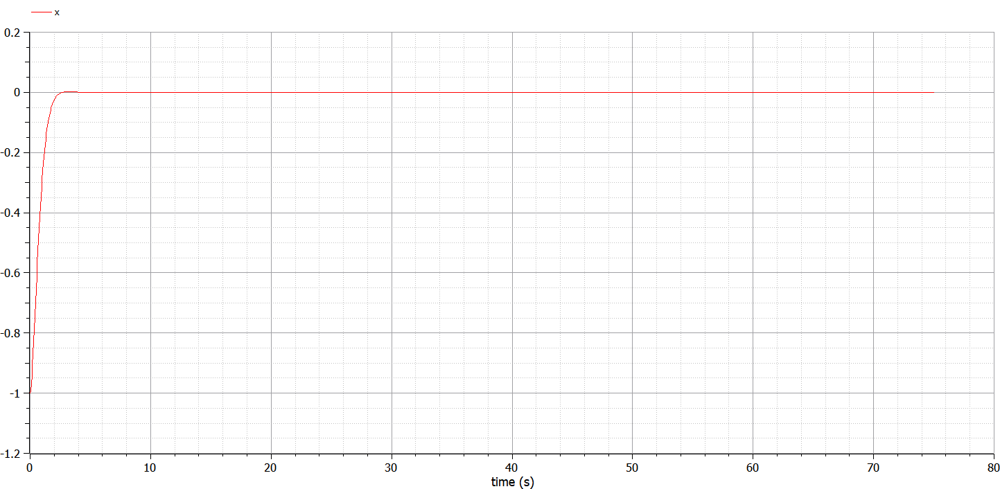
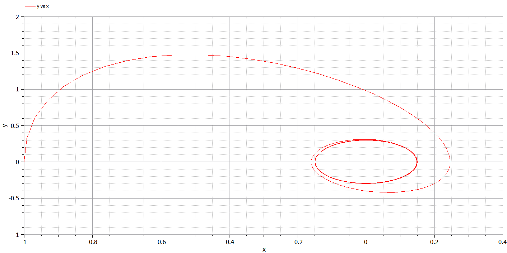

---
# Front matter
lang: ru-RU
title: "Лабораторная работа №4"
subtitle: "Модель гармонических колебаний. Вариант 13"
author: "Жижченко(Ветошкина) Валерия Викторовна"

# Formatting
toc-title: "Содержание"
toc: true # Table of contents
toc_depth: 2
lof: true # List of figures
lot: false # List of tables
fontsize: 12pt
linestretch: 1.5
papersize: a4paper
documentclass: scrreprt
polyglossia-lang: russian
polyglossia-otherlangs: english
mainfont: PT Serif
romanfont: PT Serif
sansfont: PT Serif
monofont: PT Serif
mainfontoptions: Ligatures=TeX
romanfontoptions: Ligatures=TeX
sansfontoptions: Ligatures=TeX,Scale=MatchLowercase
monofontoptions: Scale=MatchLowercase
indent: true
pdf-engine: lualatex
header-includes:
  - \linepenalty=10 # the penalty added to the badness of each line within a paragraph (no associated penalty node) Increasing the value makes tex try to have fewer lines in the paragraph.
  - \interlinepenalty=0 # value of the penalty (node) added after each line of a paragraph.
  - \hyphenpenalty=50 # the penalty for line breaking at an automatically inserted hyphen
  - \exhyphenpenalty=50 # the penalty for line breaking at an explicit hyphen
  - \binoppenalty=700 # the penalty for breaking a line at a binary operator
  - \relpenalty=500 # the penalty for breaking a line at a relation
  - \clubpenalty=150 # extra penalty for breaking after first line of a paragraph
  - \widowpenalty=150 # extra penalty for breaking before last line of a paragraph
  - \displaywidowpenalty=50 # extra penalty for breaking before last line before a display math
  - \brokenpenalty=100 # extra penalty for page breaking after a hyphenated line
  - \predisplaypenalty=10000 # penalty for breaking before a display
  - \postdisplaypenalty=0 # penalty for breaking after a display
  - \floatingpenalty = 20000 # penalty for splitting an insertion (can only be split footnote in standard LaTeX)
  - \raggedbottom # or \flushbottom
  - \usepackage{float} # keep figures where there are in the text
  - \floatplacement{figure}{H} # keep figures where there are in the text
---

# Цель работы

Рассмотреть модель гармонических колебаний, как пример одной из задач построения математических моделей.

# Задание

Построить фазовый портрет гармонического осциллятора и решение уравнения гармонического осциллятора для следующих случаев:

1. Колебания гармонического осциллятора без затуханий и без действий внешней силы $\ddot{x}+6.5x=0$;
2. Колебания гармонического осциллятора c затуханием и без действий внешней силы $\ddot{x}+4\dot{x}+5x=0$;
3. Колебания гармонического осциллятора c затуханием и под действием внешней силы $\ddot{x}+3\dot{x}+7x=\sin(2t)$;

На интервале $t\in[0; 75]$ (шаг $0.05$) с начальными условиями $x_0=-1, y_0=0$.

# Выполнение лабораторной работы

Движение грузика на пружинке, маятника, заряда в электрическом контуре, а также эволюция во времени многих систем в физике, химии, биологии и других науках при определенных предположениях можно описать одним и тем же дифференциальным уравнением, которое в теории колебаний выступает в качестве основной модели. Эта модель называется линейным гармоническим осциллятором.

Уравнение свободных колебаний гармонического осциллятора имеет следующий вид:
$$
\centering
\ddot{x}+2\gamma\dot{x}+\omega_0^2x=0(1)
$$
где $x$ – переменная, описывающая состояние системы (смещение грузика, заряд конденсатора и т.д.), 
$\gamma$ – параметр, характеризующий потери энергии (трение в механической системе, сопротивление в контуре),
$\omega_0$ – собственная частота колебаний, $t$ – время. $\left(\mbox{Обозначения }\ddot{x}=\frac{\partial^2x}{\partial^2t}, \dot{x}=\frac{\partial x}{\partial t}\right)$

Уравнение $(1)$ есть линейное однородное дифференциальное уравнение второго порядка и оно является примером линейной динамической системы.

При отсутствии потерь в системе $\left(\gamma=0\right)$ получаем
уравнение консервативного осциллятора энергия колебания которого сохраняется во времени.
$$
\centering
\ddot{x}+\omega_0^2x=0(2)
$$
Для однозначной разрешимости уравнения второго порядка $(2)$ необходимо
задать два начальных условия вида
$$
\centering
\begin{cases}
x(t_0)=x_0\\
\dot{x}(t_0)=y_0
\end{cases}
(3)
$$
Уравнение второго порядка $(2)$ можно представить в виде системы двух
уравнений первого порядка:
$$
\centering
\begin{cases}
\dot{x}=y\\
\dot{y}=-\omega_0^2x
\end{cases}
(4)
$$
Начальные условия $(3)$ для системы $(4)$ примут вид:
$$
\centering
\begin{cases}
x(t_0)=x_0\\
y(t_0)=y_0
\end{cases}
(5)
$$
Независимые переменные $x, y$ определяют пространство, в котором
«движется» решение. Это фазовое пространство системы, поскольку оно двумерно 
будем называть его фазовой плоскостью.

Значение фазовых координат $x, y$ в любой момент времени полностью
определяет состояние системы. Решению уравнения движения как функции
времени отвечает гладкая кривая в фазовой плоскости. Она называется фазовой
траекторией. Если множество различных решений (соответствующих различным 
начальным условиям) изобразить на одной фазовой плоскости, возникает общая
картина поведения системы. Такую картину, образованную набором фазовых
траекторий, называют фазовым портретом.

Код модели колебания гармонического осциллятора без затуханий и без действий внешней силы на языке Modelica
```Modelica
model lab04
parameter Real omega = sqrt(6.5);

Real x(start=-1);
Real y(start=0);
equation
der(x) = y;
der(y) = -(omega * omega) * x;
end lab04;
```

Код модели колебания гармонического осциллятора c затуханием и без действий внешней силы на языке Modelica
```Modelica
model lab04_2
parameter Real omega = sqrt(5);
parameter Real gamma = 4;

Real x(start=-1);
Real y(start=0);
equation
der(x) = y;
der(y) = -gamma * y - (omega * omega) * x;
end lab04_2;
```

Код модели колебания гармонического осциллятора c затуханием и без действий внешней силы на языке Modelica
```Modelica
model lab04_3
parameter Real omega = sqrt(7);
parameter Real gamma = 3;

Real x(start=-1);
Real y(start=0);
equation
der(x) = y;
der(y) = -gamma * y - (omega * omega) * x + sin(2 * time);
end lab04_3;
```

Фазовый портрет и решение уравнения гармонического осциллятора без затуханий и без действий внешней силы $\ddot{x}+6.5x=0$ можно видеть на (рис. -@fig:001) и (рис. -@fig:002) соответственно.

{ #fig:001 width=70% }

{ #fig:002 width=70% }

Фазовый портрет и решение уравнения гармонического осциллятора c затуханием и без действий внешней силы $\ddot{x}+4\dot{x}+5x=0$ можно видеть на (рис. -@fig:003) и (рис. -@fig:004) соответственно.

{ #fig:003 width=70% }

{ #fig:004 width=70% }

Фазовый портрет и решение уравнения гармонического осциллятора c затуханием и под действием внешней силы $\ddot{x}+3\dot{x}+7x=\sin(2t)$ можно видеть на (рис. -@fig:005) и (рис. -@fig:006) соответственно.

{ #fig:005 width=70% }

{ #fig:006 width=70% }

# Выводы

Рассмотрели модель гармонических колебаний. Провели анализ и вывод дифференциальных уравнений.
