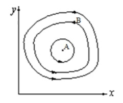
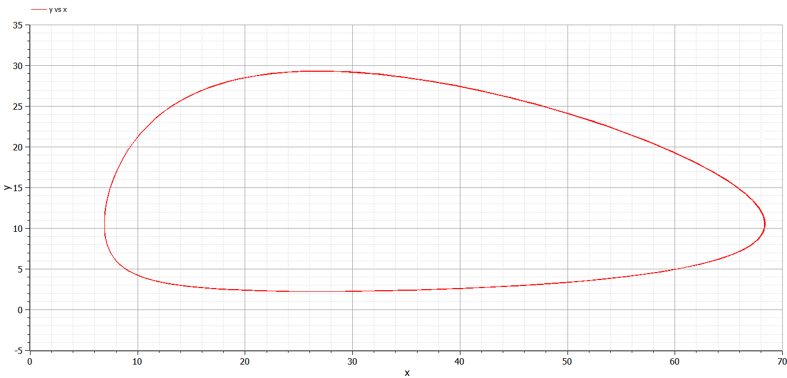
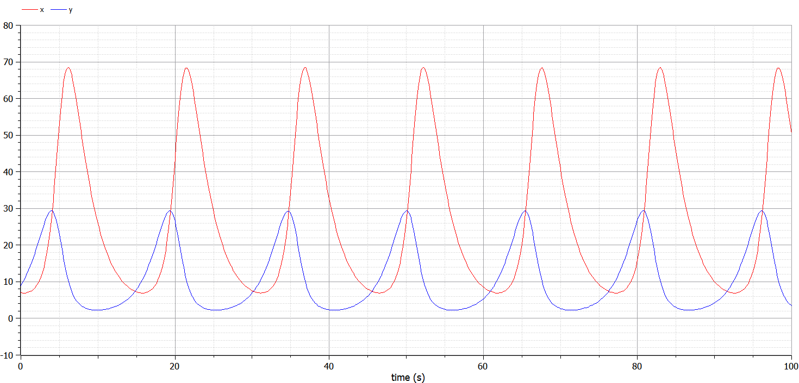

---
## Front matter
lang: ru-RU
title: Лабораторная работа №5
author: |
	Жижченко (Ветошкина) Валерия Викторона
institute: |
	RUDN University, Moscow, Russian Federation
date: 2021 Москва

## Formatting
mainfont: PT Serif
romanfont: PT Serif
sansfont: PT Serif
monofont: PT Serif
toc: false
slide_level: 2
theme: metropolis
header-includes: 
 - \metroset{progressbar=frametitle,sectionpage=progressbar,numbering=fraction}
 - '\makeatletter'
 - '\beamer@ignorenonframefalse'
 - '\makeatother'
aspectratio: 43
section-titles: true
---

# Цель работы

Рассмотреть модель хищник-жертва, как пример одной из задач построения математических моделей.

# Задание

Для модели «хищник-жертва»:

\begin{equation*}
\left\{
\begin{split}
&\frac{dx}{dt}=-0.41x(t)+0.039x(t)y(t)\\
&\frac{dy}{dt}= 0.51y(t)-0.019x(t)y(t)
\end{split}
\right.
\end{equation*}

1. Построить график зависимости численности хищников от численности жертв;
2. Построить графики изменения численности хищников и численности жертв;
3. Найти стационарное состояние системы.

При $x_0=7, y_0=9$.

# Выполнение лабораторной работы

Простейшая модель взаимодействия двух видов типа «хищник — жертва» -
**модель Лотки-Вольтерры**. Данная двувидовая модель основывается на
следующих предположениях.

## Выполнение лабораторной работы

1. Численность популяции хищников $x$ и жертв $y$ зависят только от времени
(модель не учитывает пространственное распределение популяции на
занимаемой территории);
2. В отсутствии взаимодействия численность видов изменяется по модели
Мальтуса, при этом число жертв увеличивается, а число хищников падает;
3. Естественная смертность жертвы и естественная рождаемость хищника
считаются несущественными;
4. Эффект насыщения численности обеих популяций не учитывается;
5. Скорость роста численности жертв уменьшается пропорционально
численности хищников.

## Выполнение лабораторной работы

\begin{equation}
\begin{split}
&\frac{dx}{dt}=-ax(t)+cx(t)y(t)\\
&\frac{dy}{dt}=by(t)-dx(t)y(t)
\end{split}
\label{first}
\end{equation}

## Выполнение лабораторной работы

В этой модели $x$ – число хищников, $y$ - число жертв. Коэффициент $a$
описывает скорость естественной смертности хищников, $b$ - естественного прироста жертв. Вероятность
взаимодействия жертвы и хищника считается пропорциональной как количеству
хищников, так и числу самих жертв ($xy$). Каждый акт взаимодействия способствует увеличению популяции хищников, но уменьшает
популяцию жертв (члены $cxy$ и $-dxy$ в правой части уравнения).

## Выполнение лабораторной работы

{ #fig:001 width=50% }

## Выполнение лабораторной работы

Математический анализ этой (жесткой) модели показывает, что имеется
стационарное состояние ($A$ на рис. -@fig:001), всякое же другое начальное состояние ($B$)
приводит к периодическому колебанию численности как жертв, так и хищников,
так что по прошествии некоторого времени система возвращается в состояние $B$.

## Выполнение лабораторной работы

Стационарное состояние системы (\ref{first}) (положение равновесия, не зависящее
от времени решение) будет в точке: $x_0=\frac{b}{d}, y_0=\frac{a}{c}$. Если начальные значения
задать в стационарном состоянии $x(0)=x_0, y(0)=y_0$, то в любой момент времени
численность популяций изменяться не будет. При малом отклонении от положения
равновесия численности как хищника, так и жертвы с течением времени не
возвращаются к равновесным значениям, а совершают периодические колебания
вокруг стационарной точки. Амплитуда колебаний и их период определяется
начальными значениями численностей $x(0), y(0)$. Колебания совершаются в
противофазе.

## Выполнение лабораторной работы

При малом изменении модели

\begin{equation}
\begin{split}
&\frac{dx}{dt}=-ax(t)+cx(t)y(t)+\varepsilon f(x, y)\\
&\frac{dy}{dt}=by(t)-dx(t)y(t)+\varepsilon g(x, y), \varepsilon \ll 1
\end{split}
\label{second}
\end{equation}

(прибавление к правым частям малые члены, учитывающие, например,
конкуренцию хищников за жертв и жертв за пищу), вывод о периодичности
(возвращении системы в исходное состояние $B$), справедливый для жесткой
системы Лотки-Вольтерры, теряет силу. Таким образом, мы получаем так
называемую мягкую модель «хищник-жертва». В зависимости от вида малых
поправок $f$ и $g$ возможны следующие сценарии 1-3 рис. -@fig:002.

## Выполнение лабораторной работы

{ #fig:002 width=70% }

## Выполнение лабораторной работы

В случае 1 равновесное состояние $A$ устойчиво. При любых других
начальных условиях через большое время устанавливается именно оно.

## Выполнение лабораторной работы

В случае 2 система стационарное состояние неустойчиво. Эволюция
приводит то к резкому увеличению числа хищников, то к их почти полному
вымиранию. Такая система в конце концов попадает в область столь больших или
столь малых значений $x$ и $y$, что модель перестает быть применимой.

## Выполнение лабораторной работы

В случае 3 в системе с неустойчивым стационарным состоянием $A$ с
течением времени устанавливается периодический режим. В отличие от исходной
жесткой модели Лотки-Вольтерры, в этой модели установившийся периодический
режим не зависит от начального условия. Первоначально незначительное
отклонение от стационарного состояния $A$ приводит не к малым колебаниям около
$A$, как в модели Лотки-Вольтерры, а к колебаниям вполне определенной (и не
зависящей от малости отклонения) амплитуды. Возможны и другие структурно
устойчивые сценарии (например, с несколькими периодическими режимами).

## Выполнение лабораторной работы

Вывод: *жесткую модель всегда надлежит исследовать на структурную
устойчивость полученных при ее изучении результатов по отношению к малым
изменениям модели (делающим ее мягкой)*.

## Выполнение лабораторной работы

В случае модели Лотки-Вольтерры для суждения о том, какой же из
сценариев 1-3 (или иных возможных) реализуется в данной системе, совершенно
необходима дополнительная информация о системе (о виде малых поправок $f$ и $g$ в
нашей формуле). Математическая теория мягких моделей указывает, какую именно
информацию для этого нужно иметь. Без этой информации жесткая модель может
привести к качественно ошибочным предсказаниям. Доверять выводам, сделанным
на основании жесткой модели, можно лишь тогда, когда они подтверждаются
исследованием их структурной устойчивости.

# Результаты выполнение работы

{ #fig:003 width=70% }

## Результаты выполнение работы

{ #fig:004 width=70% }

## Результаты выполнение работы

Система принимает стационарное состояние при $x_0=\frac{b}{d}=26.8421, y_0=\frac{a}{c}=10.51282$.

# Выводы

Рассмотрели модель хищник-жертва. Провели анализ и вывод дифференциальных уравнений.

## {.standout}
