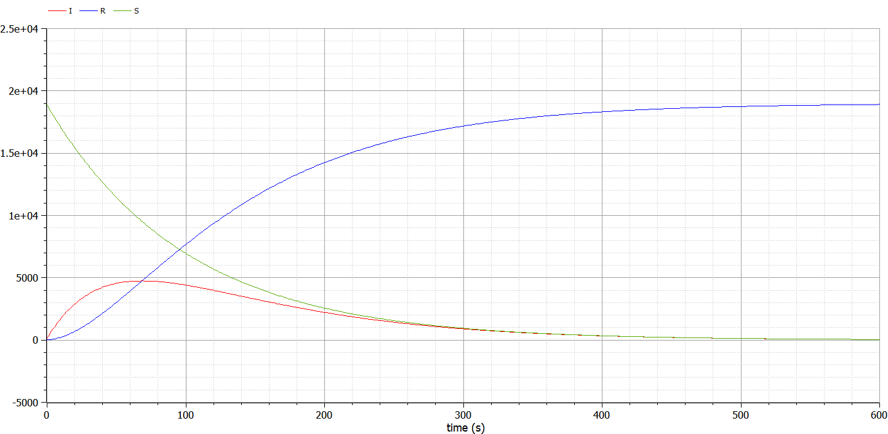

---
## Front matter
lang: ru-RU
title: Лабораторная работа №6
author: |
	Жижченко (Ветошкина) Валерия Викторовна
institute: |
	RUDN University, Moscow, Russian Federation
date: 2021 Москва

## Formatting
mainfont: PT Serif
romanfont: PT Serif
sansfont: PT Serif
monofont: PT Serif
toc: false
slide_level: 2
theme: metropolis
header-includes: 
 - \metroset{progressbar=frametitle,sectionpage=progressbar,numbering=fraction}
 - '\makeatletter'
 - '\beamer@ignorenonframefalse'
 - '\makeatother'
aspectratio: 43
section-titles: true
---

# Цель работы

Рассмотреть задачу об эпидемии, как пример одной из задач построения математических моделей.

# Задание

На одном острове вспыхнула эпидемия. Известно, что из всех проживающих
на острове ($N=19 000$) в момент начала эпидемии ($t=0$) число заболевших людей
(являющихся распространителями инфекции) $I(0)=119$, А число здоровых людей с
иммунитетом к болезни $R(0)=19$. Таким образом, число людей восприимчивых к
болезни, но пока здоровых, в начальный момент времени $S(0)=N-I(0)- R(0)$.

Постройте графики изменения числа особей в каждой из трех групп.
Рассмотрите, как будет протекать эпидемия в случае:

1. если $I(0)\le I^*$
2. если $I(0) > I^*$

# Выполнение лабораторной работы

Рассмотрим простейшую модель эпидемии. Предположим, что некая
популяция, состоящая из $N$ особей, (считаем, что популяция изолирована)
подразделяется на три группы. Первая группа - это восприимчивые к болезни, но
пока здоровые особи, обозначим их через $S(t)$. Вторая группа – это число
инфицированных особей, которые также при этом являются распространителями
инфекции, обозначим их $I(t)$. А третья группа, обозначающаяся через $R(t)$ – это
здоровые особи с иммунитетом к болезни.

## Выполнение лабораторной работы

До того, как число заболевших не превышает критического значения
$I^*$, считаем, что все больные изолированы и не заражают здоровых. Когда
$I(t)>I^*$, тогда инфицирование способны заражать восприимчивых к болезни особей.

## Выполнение лабораторной работы

Таким образом, скорость изменения числа $S(t)$ меняется по следующему закону:

\begin{equation}
\frac{dS}{dt}=
\begin{cases}
-\alpha S, \mbox{если } I(t) > I^*\\
0, \mbox{если } I(t) \le I^*
\end{cases}
\end{equation}

## Выполнение лабораторной работы

Поскольку каждая восприимчивая к болезни особь, которая, в конце концов,
заболевает, сама становится инфекционной, то скорость изменения числа
инфекционных особей представляет разность за единицу времени между
заразившимися и теми, кто уже болеет и лечится, т.е.:

\begin{equation}
\frac{dI}{dt}=
\begin{cases}
\alpha S - \beta I, \mbox{если } I(t) > I^*\\
-\beta I, \mbox{если } I(t) \le I^*
\end{cases}
\end{equation}

## Выполнение лабораторной работы

А скорость изменения выздоравливающих особей (при этом приобретающие
иммунитет к болезни)

\begin{equation}
\frac{dR}{dt}=\beta I
\end{equation}

## Выполнение лабораторной работы

Постоянные пропорциональности $\alpha, \beta$, - это коэффициенты заболеваемости
и выздоровления соответственно.
Для того, чтобы решения соответствующих уравнений определялось
однозначно, необходимо задать начальные условия. Считаем, что на начало
эпидемии в момент времени $t=0$ нет особей с иммунитетом к болезни $R(0)=0$, а
число инфицированных и восприимчивых к болезни особей
$I(0)$ и $S(0)$
соответственно. Для анализа картины протекания эпидемии необходимо
рассмотреть два случая: $I(0) \le I^*$ и $I(0) > I^*$.

# Результаты выполнение работы

{ #fig:001 width=70% }

## Результаты выполнение работы

{ #fig:002 width=70% }

## Результаты выполнение работы

Коэффициенты $\alpha = 0.01, \beta = 0.02$.

# Выводы

Рассмотрели задачу об эпидемии. Провели анализ и вывод дифференциальных уравнений.

## {.standout}
