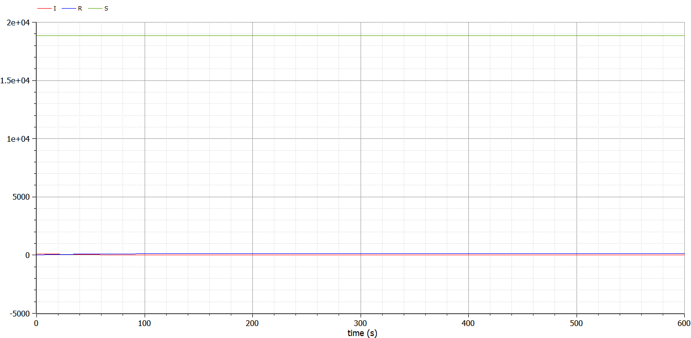

---
# Front matter
lang: ru-RU
title: "Лабораторная работа №6"
subtitle: "Задача об эпидемии. Вариант 13"
author: "Жижченко (Ветошкина) Валерия Викторовна"

# Formatting
toc-title: "Содержание"
toc: true # Table of contents
toc_depth: 2
lof: true # List of figures
lot: false # List of tables
fontsize: 12pt
linestretch: 1.5
papersize: a4paper
documentclass: scrreprt
polyglossia-lang: russian
polyglossia-otherlangs: english
mainfont: PT Serif
romanfont: PT Serif
sansfont: PT Serif
monofont: PT Serif
mainfontoptions: Ligatures=TeX
romanfontoptions: Ligatures=TeX
sansfontoptions: Ligatures=TeX,Scale=MatchLowercase
monofontoptions: Scale=MatchLowercase
indent: true
pdf-engine: lualatex
header-includes:
  - \linepenalty=10 # the penalty added to the badness of each line within a paragraph (no associated penalty node) Increasing the value makes tex try to have fewer lines in the paragraph.
  - \interlinepenalty=0 # value of the penalty (node) added after each line of a paragraph.
  - \hyphenpenalty=50 # the penalty for line breaking at an automatically inserted hyphen
  - \exhyphenpenalty=50 # the penalty for line breaking at an explicit hyphen
  - \binoppenalty=700 # the penalty for breaking a line at a binary operator
  - \relpenalty=500 # the penalty for breaking a line at a relation
  - \clubpenalty=150 # extra penalty for breaking after first line of a paragraph
  - \widowpenalty=150 # extra penalty for breaking before last line of a paragraph
  - \displaywidowpenalty=50 # extra penalty for breaking before last line before a display math
  - \brokenpenalty=100 # extra penalty for page breaking after a hyphenated line
  - \predisplaypenalty=10000 # penalty for breaking before a display
  - \postdisplaypenalty=0 # penalty for breaking after a display
  - \floatingpenalty = 20000 # penalty for splitting an insertion (can only be split footnote in standard LaTeX)
  - \raggedbottom # or \flushbottom
  - \usepackage{float} # keep figures where there are in the text
  - \floatplacement{figure}{H} # keep figures where there are in the text
---

# Цель работы

Рассмотреть задачу об эпидемии, как пример одной из задач построения математических моделей.

# Задание

На одном острове вспыхнула эпидемия. Известно, что из всех проживающих
на острове ($N=19 000$) в момент начала эпидемии ($t=0$) число заболевших людей
(являющихся распространителями инфекции) $I(0)=119$, А число здоровых людей с
иммунитетом к болезни $R(0)=19$. Таким образом, число людей восприимчивых к
болезни, но пока здоровых, в начальный момент времени $S(0)=N-I(0)- R(0)$.

Постройте графики изменения числа особей в каждой из трех групп.
Рассмотрите, как будет протекать эпидемия в случае:

1. если $I(0)\le I^*$
2. если $I(0) > I^*$

# Выполнение лабораторной работы

Рассмотрим простейшую модель эпидемии. Предположим, что некая
популяция, состоящая из $N$ особей, (считаем, что популяция изолирована)
подразделяется на три группы. Первая группа - это восприимчивые к болезни, но
пока здоровые особи, обозначим их через $S(t)$. Вторая группа – это число
инфицированных особей, которые также при этом являются распространителями
инфекции, обозначим их $I(t)$. А третья группа, обозначающаяся через $R(t)$ – это
здоровые особи с иммунитетом к болезни.

До того, как число заболевших не превышает критического значения
$I^*$, считаем, что все больные изолированы и не заражают здоровых. Когда
$I(t)>I^*$, тогда инфицирование способны заражать восприимчивых к болезни особей.

Таким образом, скорость изменения числа $S(t)$ меняется по следующему закону:

\begin{equation}
\frac{dS}{dt}=
\begin{cases}
-\alpha S, \mbox{если } I(t) > I^*\\
0, \mbox{если } I(t) \le I^*
\end{cases}
\end{equation}

Поскольку каждая восприимчивая к болезни особь, которая, в конце концов,
заболевает, сама становится инфекционной, то скорость изменения числа
инфекционных особей представляет разность за единицу времени между
заразившимися и теми, кто уже болеет и лечится, т.е.:

\begin{equation}
\frac{dI}{dt}=
\begin{cases}
\alpha S - \beta I, \mbox{если } I(t) > I^*\\
-\beta I, \mbox{если } I(t) \le I^*
\end{cases}
\end{equation}

А скорость изменения выздоравливающих особей (при этом приобретающие
иммунитет к болезни)

\begin{equation}
\frac{dR}{dt}=\beta I
\end{equation}

Постоянные пропорциональности $\alpha, \beta$, - это коэффициенты заболеваемости
и выздоровления соответственно.
Для того, чтобы решения соответствующих уравнений определялось
однозначно, необходимо задать начальные условия. Считаем, что на начало
эпидемии в момент времени $t=0$ нет особей с иммунитетом к болезни $R(0)=0$, а
число инфицированных и восприимчивых к болезни особей
$I(0)$ и $S(0)$
соответственно. Для анализа картины протекания эпидемии необходимо
рассмотреть два случая: $I(0) \le I^*$ и $I(0) > I^*$.

Код для случая $I(0) \le I^*$ на языке Modelica

```
model lab06
parameter Real a = 0.01;
parameter Real b = 0.02;

parameter Integer N = 19000;
parameter Integer I0 = 119;
parameter Integer R0 = 19;
parameter Integer S0 = N - I0 - R0;

Real I (start = I0);
Real R (start = R0);
Real S (start = S0);

equation
der(I) = -b * I;
der(R) = b * I;
der(S) = 0;
end lab06;
```
Код для случая $I(0) > I^*$ на языке Modelica

```
model lab06_2
parameter Real a = 0.01;
parameter Real b = 0.02;

parameter Integer N = 19000;
parameter Integer I0 = 119;
parameter Integer R0 = 19;
parameter Integer S0 = N - I0 - R0;

Real I (start = I0);
Real R (start = R0);
Real S (start = S0);

equation
der(I) = a * S - b * I;
der(R) = b * I;
der(S) = - a * S;
end lab06_2;
```

График для случая $I(0) \le I^*$ можно видеть на рис. -@fig:001.

{ #fig:001 width=70% }

График для случая $I(0) > I^*$ можно видеть на рис. -@fig:002.

{ #fig:002 width=70% }

Коэффициенты $\alpha = 0.01, \beta = 0.02$.

# Выводы

Рассмотрели задачу об эпидемии. Провели анализ и вывод дифференциальных уравнений.
